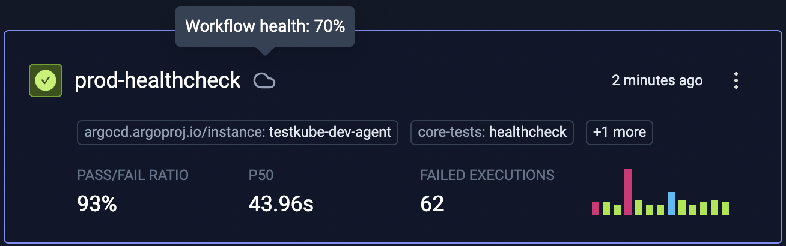

# Workflow Health & Flakiness

Testkube introduces **Workflow Health** as a core metric to help you evaluate the *reliability* and *stability* of your Test Workflows over time.
This metric incorporates not only how often your workflows pass or fail, but also how consistent their outcomes are—an essential signal for identifying **flaky workflows** and improving test reliability at scale.

---

## What is Workflow Flakiness?

Workflow **flakiness** refers to non-deterministic or inconsistent test results—tests that sometimes pass and sometimes fail without changes to the underlying system. Flaky workflows can lead to:

- False negatives that block deployments
- Wasted debugging time
- Reduced developer confidence in test outcomes

> Testkube tracks flakiness at the **Workflow-level** to provide a broader view of system reliability.
> **Test-level** flakiness will be introduced in a future release.

---

## What is Workflow Health?

**Workflow Health** is a score that quantifies the reliability of a given Test Workflow, taking into account both its pass rate and its flakiness.
The higher the score, the more consistently reliable the workflow is.

> **Formula:**
> `Workflow Health = PASS_RATE × (1 - FLIP_RATE)`

Where:

- **PASS_RATE** is the ratio of successful workflow executions over the last 10 runs.
- **FLIP_RATE** is the ratio of consecutive status changes (pass → fail or fail → pass) to total transitions, indicating instability.

Based on the health score, the workflows will have either a **sunny** (100%), **cloudy** (30-99%), or **stormy** (0-29%) status.

### Example

If a test workflow passed 8 out of its last 10 runs (80% pass rate) and flipped status 4 times (i.e., pass → fail or fail → pass), then:

- `PASS_RATE = 8 / 10 = 0.8`
- `FLIP_RATE = 4 / 9 = 0.444`
- `Workflow Health = 0.8 × (1 - 0.444) ≈ 0.444`

This means the workflow appears healthy at first glance (80% pass rate), but its frequent status changes reduce confidence in its stability.

* **sunny** (100%)

* **cloudy** (70%)

* **stormy** (0%)

---

## Why It Matters

By incorporating both **test outcome** and **flakiness**, Workflow Health helps you:

- **Identify unreliable workflows** even when pass rates are high
- **Prioritize test stabilization** efforts in CI/CD pipelines
- **Track quality regressions** after new changes are introduced
- **Drive accountability** for test reliability across teams
