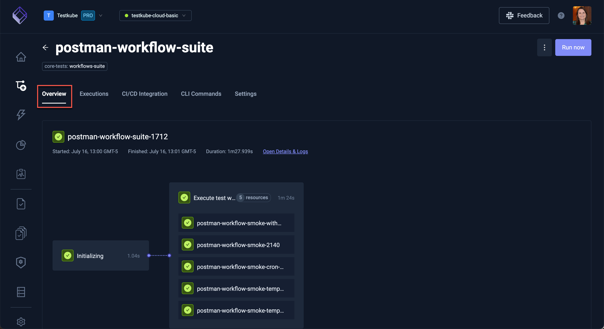
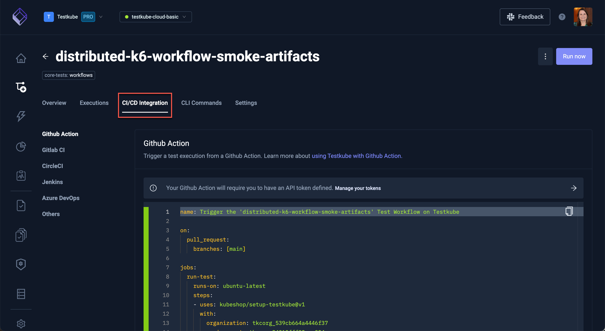

# Explore the Workflows Dashboard

The Workflows Dashboard displays the current status of workflows executed in the organization and environment selected at the top of the screen.

Use the Search box and the Labels and Status filters to easily locate certain workflows.

You can also switch from the Grid view to a Table view of all workflows in the selected environment.

On the **Worklfow Templates** tab, you will find templates to use to create workflows.

Click the **Add a new template** button to create a new workflow template. The options are:

- **Git content**: Create a template to use a git source across multiple test workflows.
- **Static content**: Create a template to use a static file across multiple test workflows.
- **Testing tool**: Create a template with a
container/runnable testing tool across to base your test workflows on.
- **Import from YAML**: Create a template from scratch or copy/paste YAML examples.

## Workflow Details

Select a workflow from the list to see its details.

### Overview Tab

Click **Open Detail & Logs** to get more details for the workflow execution:

### Executions Tab

The **Executions** tab has the list of the workflow executions. A green checkmark denotes a successful execution, a red 'x' denotes a failed execution and circling dots denotes a current run.

### CI/CD Integration Tab

The **CI/CD Integration** tab shows any integrations used in the workflow.

The **CLI Commands** tab shows the commands used to perform the selected test:

Use the **Settings** tab to view or change the local settings of the workflow.

