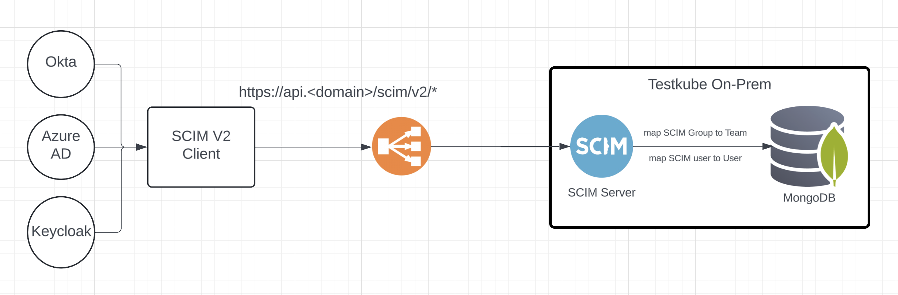

# SCIM Integration

## Introduction

### What is SCIM?

**System for Cross-domain Identity Management (SCIM)** is a protocol designed to make managing identities in multi-domain environments easier. It defines a standard schema and set of RESTful APIs that allow identity data to be communicated between:
- **Identity Providers (IdPs)** such as Okta, Azure AD, Ping Identity, OneLogin, etc.
- **Service Providers** or **applications** like Testkube, Slack, G Suite, etc.

### Key SCIM Concepts
1. **Users** – Represent individual identities in SCIM.
2. **Groups** – Collections of users or nested groups, often mapped to `teams` or `roles` in different applications.
3. **Schemas** – Define the standard attributes (e.g., `userName`, `displayName`, `emails`) and extension attributes to represent identity data.
4. **Endpoints** – SCIM uses RESTful endpoints for CRUD operations on Users and Groups, typically exposed under a base path such as `/scim/v2/Users` or `/scim/v2/Groups`.

---

### SCIM Client vs. SCIM Server

#### SCIM Client

A **SCIM Client** is typically the **Identity Provider** that **initiates** requests to manage user and group data:
- Creates or updates users in the target application (the SCIM server).
- Adds or removes users from groups.
- Deprovisions (deletes) users when access is no longer needed.

**Examples**:
- Okta acts as a SCIM client by sending user-provisioning requests to Testkube.
- Azure AD automatically creates or updates user accounts in Testkube via SCIM.

#### SCIM Server

A **SCIM Server** is a **Service Provider** that **exposes** SCIM endpoints:
- Receives requests from SCIM clients (IdPs) and updates its local user directory or membership data accordingly.
- Provides responses with updated resource data (users or groups).

**Examples**:
- Testkube acts as the SCIM server, listening for inbound provisioning requests and updating its internal user/team membership.

---

## Testkube SCIM Integration

### Why Integrate SCIM with Testkube?
- **Centralized Identity Management**  
  Use your existing IdP (e.g., Okta, Azure AD) to add and remove users or teams in Testkube automatically. By consolidating identity management, you reduce duplication of user records and simplify the overall provisioning process across various tools and platforms.

- **Reduced Manual Effort**  
  Eliminates the need for separate local user management within Testkube. Instead of juggling multiple accounts and configurations, administrators can rely on the IdP to handle the entire lifecycle of user accounts and group memberships.

- **Security and Compliance**  
  Ensures that user de-provisioning is consistent across all systems, reducing risk. This uniform approach helps organizations meet audit and compliance requirements by clearly demonstrating how access is revoked when an individual no longer needs it.

If SCIM server is enabled, users cannot log in to Testkube before they are provisioned via SCIM.

### Architecture Overview



1. **Identity Provider (SCIM Client)**  
   Users and Groups are configured in the Identity Provider and SCIM (Client) integration provisions them automatically in Testkube.

2. **Testkube SCIM Endpoints (SCIM Server)**  
   Testkube exposes a separate SCIM server with `/Users` and `/Groups` (and other standard) endpoints to accept provisioning requests from SCIM Client.

3. **Internal User Management**  
   Testkube translates SCIM calls into internal operations (creating teams, adding/removing users, assigning roles, etc.) and maps SCIM Groups into Testkube Teams.

4. **Authentication and Authorization**  
   Testkube SCIM server uses Bearer Token authentication to validate incoming requests and enforce access control, so an API token needs to be generated and configured in the IdP's SCIM client.

### Configuration

1. Set the `SCIM_SERVER_ENABLED` environment variable to `true` in the Testkube Enterprise API or `testkube-cloud-api.scim.enabled: true` if installing the `testkube-enterprise` Helm chart.
2. Set the `SCIM_SERVER_DEFAULT_ORGANIZATION` environment variable or `testkube-cloud-api.scim.defaultOrganization` if installing the `testkube-enterprise` Helm chart to the default organization name for new users and groups ([bootstrap feature](https://docs.testkube.io/articles/install/advanced-install#bootstrap-user-mapping) can be used to create the default organization).
3. The default port for the SCIM server is `8081`. You can change it by setting the `SCIM_SERVER_PORT` environment variable ir `testkube-cloud-api.scim.port` if installing the `testkube-enterprise` Helm chart.
4. Set the `SCIM_SERVER_AUTH_TOKEN` environment variable or `testkube-cloud-api.scim.auth.token` if installing the `testkube-enterprise` Helm chart to a secure token that will be used to authenticate SCIM requests or create a Kubernetes secret with a key named `SCIM_AUTH_TOKEN` and set the `testkube-cloud-api.scim.auth.secretRef` to point to that secret. If token is not set, SCIM server will run without auth.
5. Configure the SCIM client in your IdP (e.g., Okta, Azure AD) to point to the Testkube SCIM endpoints.

### Roles and Entitlements

For assigning roles to Users and Groups, Testkube SCIM server checks does the resource (User or Group) have the `roles` field and assigns the roles to the User or Group based on the value of the `roles` field.
The `roles` field should be an array of strings where each string is a Role [Uniform Resource Name](https://en.wikipedia.org/wiki/Uniform_Resource_Name).

Example:
```json
{
  "roles": [
    "urn:testkube:role:organization:*:member",
    "urn:testkube:role:environment:my-env:admin"
  ]
}
```

This example would assign a User or Group the `member` role in all organizations and the `admin` role in the `my-env` environment.

For assigning Users and Groups to Testkube Environments or Resource Groups, Testkube SCIM server checks does the resource (User or Group) have the `entitlements` field and assigns the User or Group to an Environment or Resource Group based on the value of the `entitlements` field.
The `entitlements` field should be an array of strings where each string is an Entitlement [Uniform Resource Name](https://en.wikipedia.org/wiki/Uniform_Resource_Name).

Example:
```json
{
  "entitlements": [
    "urn:testkube:entitlement:environment:my-env",
    "urn:testkube:entitlement:resource-group:my-rg"
  ]
}
```

This example would assign a User or Group to the `my-env` environment and the `my-rg` resource group.
If an Environment with the specified name does not exist, it will be created.

:::info
When SCIM is enabled all member roles/permissions are managed through the mechanism described above, and the 
corresponding role/permission management is disabled in the Testkube Dashboard.
:::

## Not supported
- `PATCH` operations are currently not supported

---

## Additional Resources
- [SCIM Specification (RFC 7643 & 7644)](https://datatracker.ietf.org/doc/html/rfc7643)
- [Okta SCIM Provisioning Documentation](https://help.okta.com/en-us/content/topics/apps/apps_app_integration_wizard_scim.htm)
- [Configure SCIM provisioning using Microsoft Entra ID (Azure Active Directory)](https://learn.microsoft.com/en-us/azure/databricks/admin/users-groups/scim/aad)

*This document reflects the general guidelines and best practices for SCIM integration with Testkube. Refer to the specific version of Testkube you are running for exact configuration steps and endpoint availability.*
