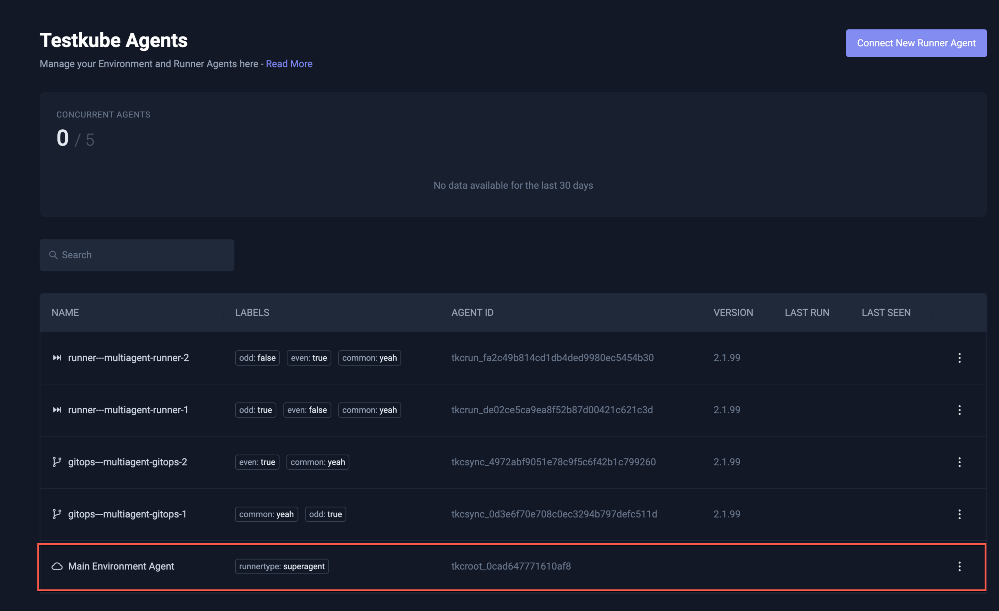
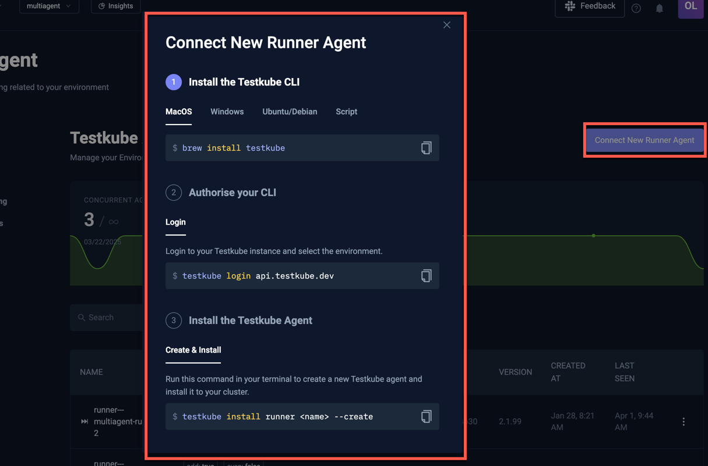
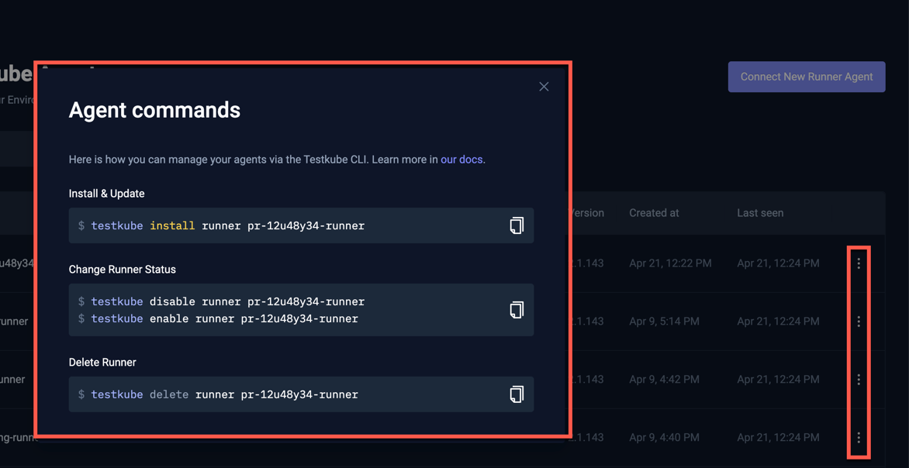
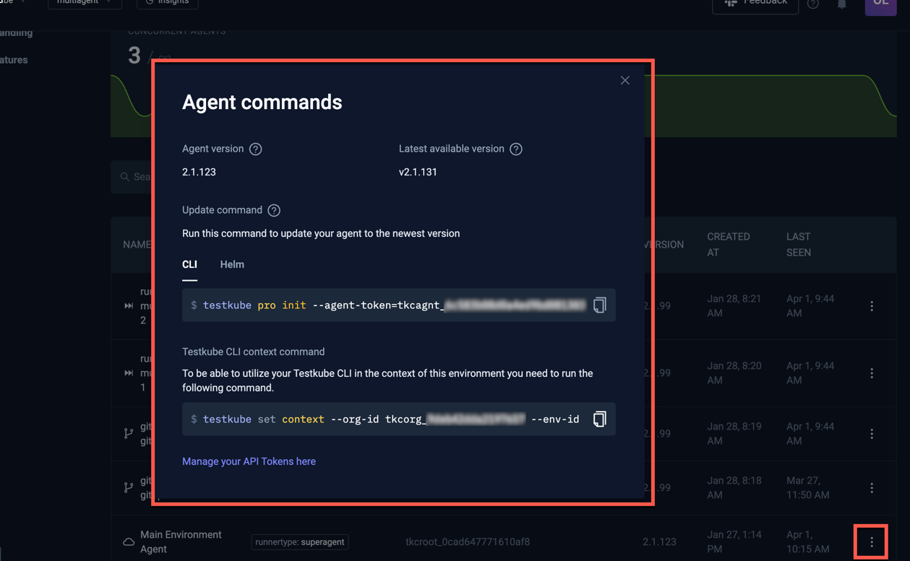

# Agent Management

With the introduction of [Multi-Agent support](/articles/install/multi-agent), Testkube Environments can now contain
two types of agents:

- Lightweight **Runner Agents**, of which there can be as many as needed. 
- A single and required **Standalone Agent** which provides core Environment functionality for Triggers, Webhooks, 
  Prometheus metrics, etc.

The Agent Management panel shows a graph of concurrent Runner Agent usage over time and below that a 
table of currently registered Agents, with columns for their different attributes.

The Standalone Agent is always shown last in this table with the label "superagent":

## Adding a Runner Agent

Use the "Connect New Runner Agent" button on the top right to add a new Runner Agent to your Environment. 

This will open the below dialog providing you with the necessary commands to install and connect a new Runner
Agent to the current Testkube Environment.

Once added, the Runner Agent will be available for running your Workflows as described at [Running a Worklfow](/articles/testkube-dashboard-workflow-details#running-a-workflow)  

## Managing an existing Runner Agent

Existing agents are currently managed via the Testkube CLI, use the popup menu to the right in the table 
to see examples of applicable CLI commands:

:::tip
Check out [Multi-Agent CLI Overview](/articles/multi-agent-cli) for an overview of all Testkube CLI commands for
working with Testkube Agents.
:::

## Managing the Standalone Agent

The Standalone Agent shown last in the list has a different set of commands as it is always required. The dialog contains 
the following information: 

- The connection status and name of the agent.
- Which Testkube version the Agent is running, and the latest available version (so you know if an upgrade is available).
- CLI and Helm commands to install or update the Agent to the latest version.
- The `testkube set context` CLI command to configure the Testkube CLI for this agent - [Read More](/testkube-pro/articles/managing-cli-context).

