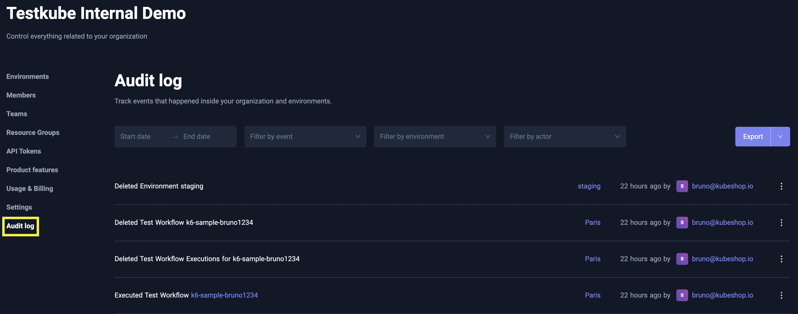
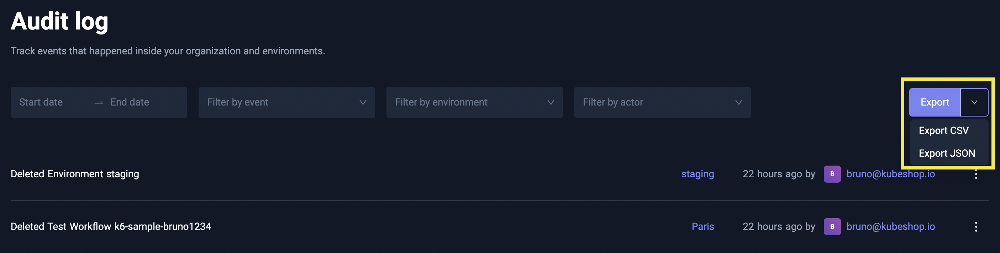

# Testkube Audit Logs

**Testkube** records significant events in its internal **Audit Log**, 
providing **Organization Owners** and **Admins** with valuable insights into 
how **Organization Members** are using the platform.

These logs can help monitor usage patterns, identify security risks, and ensure compliance with internal policies.

## Accessing Audit Logs

**Audit Logs** can be accessed via the **Audit log** menu item under the **Organization Management** page.

Here, **Organization Owners** and **Admins** can review detailed records of user actions.

## Filtering Audit Logs

Events in the Audit Log can be filtered using various parameters to focus on specific actions or time frames:
* **Date Range**: Filter by the time period during which the events were recorded.
* **Event Type**: For example, filter for actions like **Environment Deleted** or **Test Workflow Executed**.
* **Environment**: Focus on a specific environment within the organization.
* **Actor**: Filter by the specific user or service that initiated the event.

## Exporting Audit Logs

**Audit Logs** can also be exported for further analysis. Supported formats are:
* **CSV**
* **JSON**

This makes it easy to integrate the audit log events with other reporting or analysis tools.

## Retention Period

By default, audit log events are retained for **180 days**. After this period, the logs are automatically cleaned up to optimize storage.

## Console Logging

By default, Testkube does **not** emit audit events to the console. Turning this on can help with real-time debugging and monitoring—but may expose sensitive user data.

- **Enable Console Logging**  
  Streams audit events to stdout.

- **Anonymize User Information**  
  When console logging is enabled, log only the user’s internal ID (not their username/email).

> ⚠️ Console logs can leak sensitive details. If you need privacy, enable anonymization.

See the **Configuration** section for the corresponding Helm parameters or environment variables.

## Configuration

If you are using **Testkube On-Prem**, audit log settings can be configured during installation via **Helm** parameters:
* **Retention Period**: Customize the number of days to retain audit log events - `audit.cleanup.retentionPeriod` (default: `30`)
* **Audit Log Cleanup**: Control whether automatic cleanup is enabled - `audit.cleanup.enabled` (default: `true`)
* **Cleanup Interval**: Define how often the cleanup job runs, using a cron expression - `audit.cleanup.cronInterval` (default: `0 3 * * *`)
* **Enable Console Logging**: Toggle whether audit log events should also be logged to console - `audit.logger.enabled` (default: `false`)
* **Anonymize User Information**: If console logging is enabled and this toggle is enabled, audit log events console logs will only contain user ID and not username/email - `audit.logger.forceIdentifyUsersById` (default: `false`)
