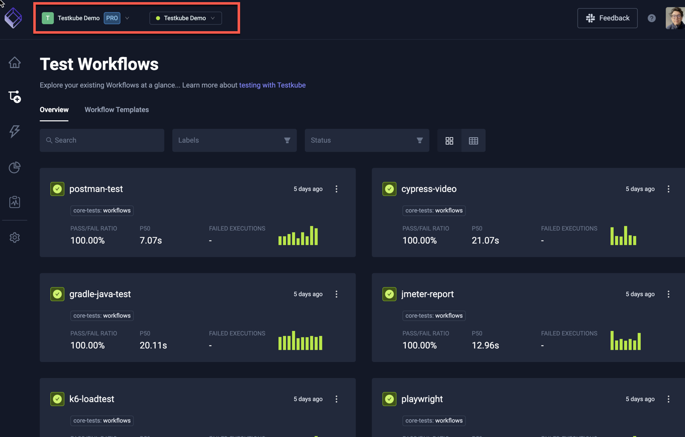
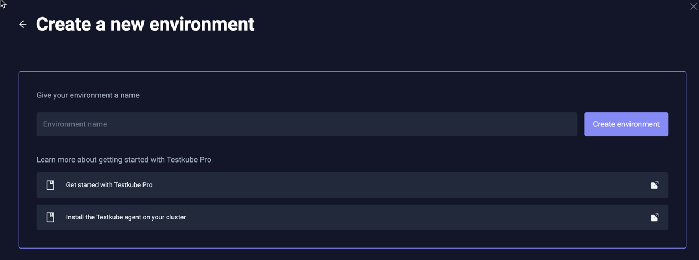
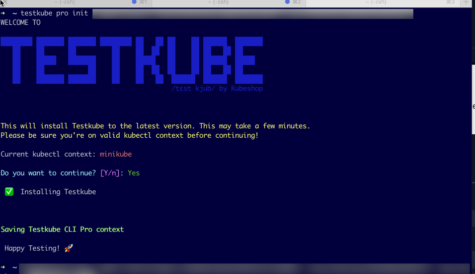

# Environment Management

An environment is a grouping Workflows, Execution Results, Triggers and Webhooks.

:::info
A Testkube environment is managed by a Testkube Agent running in your Kubernetes Cluster - read more [here](../articles/architecture.md).
:::

## Creating a New Environment

You can create a new environment from the "Environments" drop down in the header section of the Testkube Dashboard.

### Cloud Options

When creating a new environment in Testkube Cloud, you will first be prompted with the following options:

1. **I have a K8s Cluster** - select this if you have a cluster where you can install the Testkube Agent for your 
  environment. 
2. **No Cluster at hand** - setting up a local cluster for evaluation purposes is straightforward, for example using [kind](https://kind.sigs.k8s.io/) 
  or [minikube](https://minikube.sigs.k8s.io/docs/). Alternatively, you can use our demo environment for exploring Testkube functionality with having to install anything.
3. **I don't use Kubernetes** - if you're not familiar with Kubernetes and don't want to install a local cluster, you can use
   our demo environment for exploring Testkube functionality with having to install anything. 

:::tip
### Testkube Demo Environment

The Testkube Demo environment available in Testkube Cloud is a great way to explore the functionality provided by Testkube. 
It contains a large collection of Workflows for different testing tools, with corresponding execution results and
Test Insights. 

You are added as a member with the Run role (see [below](/testkube-pro/articles/environment-management#environment-members)), 
which gives you read-only access to explore and run these workflows and their results, as well as read-only access to 
all other major features of Testkube.

:::

### Environment name

Creating an environment in Testkube on-prem or selecting **Let's get started** in the cloud-specific dialog above will show
a prompt for a unique environment name:

### Environment connection

After providing the environment name you will be prompted as shown below to [Install the CLI](/articles/install/cli) 
(do this only if you haven't already done so) and then run a CLI command to install the 
Testkube Agent for your environment, see [Testkube Agent Installation][installing] for more details.

Running the provided Testkube CLI command in your terminal will install the agent and connect it to the created environment:

Once connected, you should see a corresponding status update in the dialog above to indicate that the installation
was successful.

## Environment Settings

You can access the settings for an existing Environment either from the same top-level menu or the corresponding
toolbar buttton on the left:

There are 4 tabs for managing your Environment.

### General

Find the general settings for your environment on the **General** tab. You can also delete the environment here, but, be aware, this action cannot be undone.

### Agent Information

The middle section of the General tab presents information about the agent connected to this Environment, showing you:

- The connection status and name of the agent.
- Which Testkube version the Agent is running, and the latest available version (so you know if an upgrade is available).
- CLI and Helm commands to install or update the Agent to the latest version.
- The `testkube set context` CLI command to configure the Testkube CLI for this agent - [Read More](/testkube-pro/articles/managing-cli-context).

### Environment Members

You can assign environment-specific roles to [Teams](/articles/teams) or individual [Members](/testkube-pro/articles/organization-management#members) of your organization to control which 
actions a member can perform in a specific environment.

To add new members to an Environment, select the Members tab under the Environment settings and use the "Add Collaborators"
section to search for and add individual members or teams from your organization.

You can choose from one of the following roles for a member:

- `Read`: Has Read access only to all entities in an environment, test results, artifacts, logs, etc...
- `Run`: Has Read access and can trigger executions.
- `Write`: Has Run access and can make changes to environment tests, triggers, webhooks, etc...
- `Admin`: Has Write access and is allowed to invite and change other collaborator roles.

:::info
Keep in mind that all organization `admin` users can always access all environments.
:::

:::tip
Have a look at  [Resource Access Management](/articles/resource-access-management) to get an overview of how Testkube
allows you to manage and apply Resource Access controls.
:::

You can see a list of existing Environment members at the bottom of this panel, and change their role or remove them
using the popup menu on the right:

### Keyword Handling

This tab allows you to manage the Filtering categories available for [Log Highlighting](/testkube-pro/articles/log-highlighting)

There are 4 default categories, represented with a few keywords each:

| Category                   | Keywords                                                            |
|----------------------------|---------------------------------------------------------------------|
| **Error Keywords**         | Error, Exception, Fail, Critical, Fatal                             |
| **Connection**             | Connection, Disconnect, Lost, Timeout, Refused, Handshake, Retrying |
| **Resource Issues**        | OutOfMemory, MemoryLeak, ResourceExhausted, LimitExceeded, Quota    |
| **Access & Authorization** | Denied, Unauthorized, Forbidden, Invalid, Invalid Token, Expired    |

You can add/edit/remove categories using the corresponding actions in the interface.

### Product Features

There is currently only one product feature that can be toggled on or off; Legacy Test Support - [Read More](/articles/legacy-features)

[installing]: ../../articles/install/multi-cluster.md
