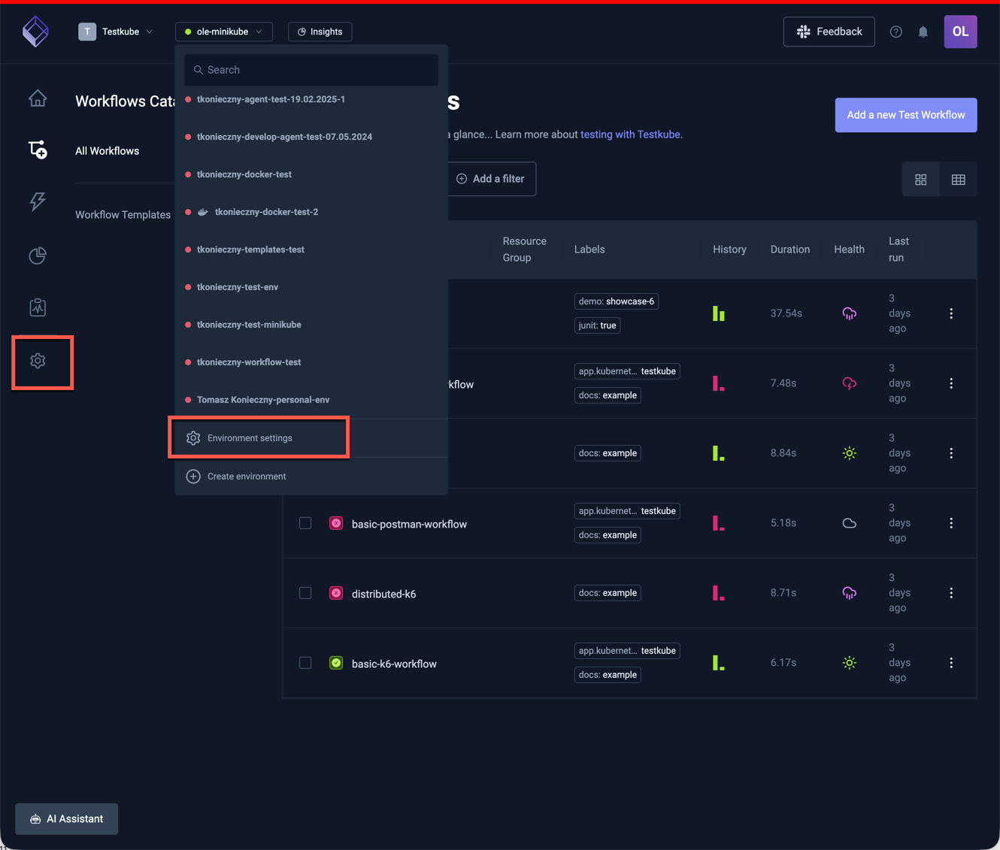

# Environment Management

An environment is a grouping of users, workflows, results, triggers, and webhooks.

:::info
 A Testkube environment is managed by a Testkube Agent running in your Kubernetes Cluster - read more [here](../articles/architecture.md).
:::

## Creating a New Environment

You can create a new environment from the "Environments" drop down in the header section of the Testkube UI.

For installation instructions, please visit [Testkube Agent Installation][installing].

## Changing Environment Settings

On the "General" tab, you can see environment information:

- Connection state
- Agent name
- Agent version - If a new Testkube Agent version is available, you'll be prompted to upgrade.
- Testkube CLI context command - To configure your Testkube CLI with pro context.

You can also delete a given environment (be careful, this action can't be rolled-back!)

## Managing Environment Member Roles

You can assign environment-specific roles to your organisation members to control which actions a member
can perform in a specific environment. Keep in mind that all organisation `admin` users can access all environments.

To add new organization members use the "Members" tab and select "organization members" under the "Add collaborators" section.

You can choose from one of the following roles for a member:

- `Read`: Has Read access only to all entities in an environment, test results, artifacts, logs, etc...
- `Run`: Has Read access and can trigger executions.
- `Write`: Has Run access and can make changes to environment tests, triggers, webhooks, etc...
- `Admin`: Has Write access and is allowed to invite and change other collaborator roles.

[installing]: ../../articles/install/multi-cluster.md
