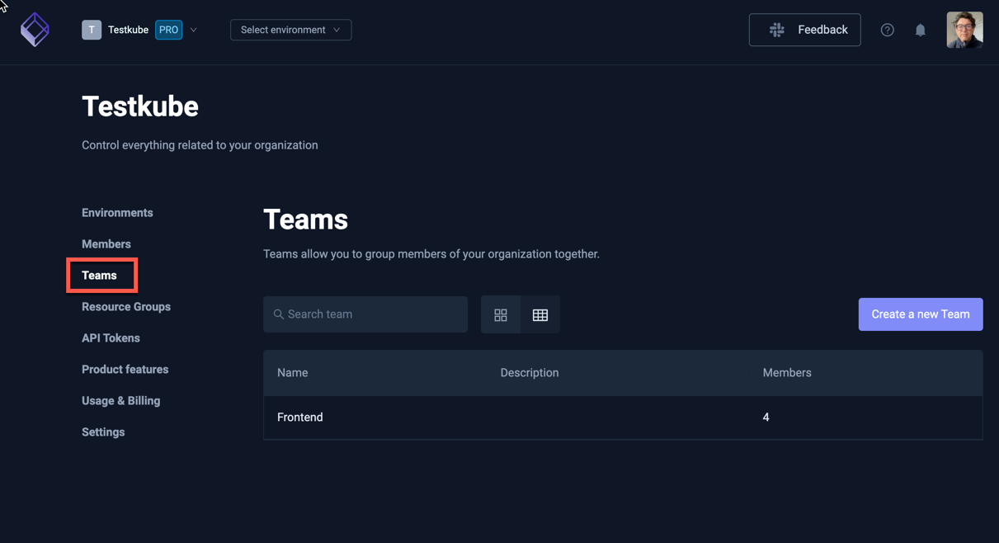

# Organization Management

To manage your organization settings click "Organization Management" from organizations drop-down menu:


(You can also create new organizations from this menu).

The following tabs are available for managing an Organization.

## Environments

In the environments section, you can see the list of your existing environments.


GREEN status means that your agent is connected successfully. 

In the case of a RED status, you can try to debug the issues with the command below:

```sh
testkube agent debug
```

Run this on your cluster where the given agent is installed.

Read more about [Environment Management](../articles/environment-management.md).

## Members

Invite and manage your organization members here. 

:::info
Please read [Resource Access Management](/articles/resource-access-management) to get an overview of how Testkube
allows you to manage and apply Resource Access controls for Organization Members.
:::

### Inviting Members

Invite new members by specifying 
- Emails - a comma-separated list of emails to invite.
- Role - there are 4 roles for organization members:
  - `Owner` - Has access to all environments and organization settings, also can access billing details.
  - `Admin` - Has access to all environments and organization settings.
  - `Member` - Has limited access to environments, access is defined by the roles assigned to given member. Member by default doesn't have any access, you need to [explicitly set it in the given environment](environment-management.md).
  - `Biller` - Has access to billing details only.
- Teams - which Teams the invited members should belong to.
- Environments - which Environments the invited members should be added to, with their corresponding Environment Role

Once all specified, select the Invite button in the bottom right.


:::tip
For Testkube On-Prem deployments you can configure default organizations, environments and roles for users - see 
[Bootstrap User Mapping](/articles/install/advanced-install#bootstrap-user-mapping).
:::

### Manage existing Members

Manage existing members in the list of members at the bottom of the tab. Use the menu to the right for 
each member to delete them or change their role.


### Manage pending Invites

Manage pending member invites in the lists at the bottom of the tab. Use the menu to the right for
each invite to update, revoke or resent the invite.


## Teams

Teams allow you to group Organization members to simplify access control management for Environments
and Resource Groups - [Read More](/articles/teams).



## Resource Groups

Resource Groups allow you to group Testkube Resources across all your environments and assign
member access - [Read More](/articles/resource-groups).


## API Tokens

API tokens allows running tests without linking the run to a specific account - see [API Token Management](api-token-management) 
for more details on how to create and use API Tokens.


## Product Features

This tab allows you to configure Organization-level Product Features:

- **Resource Groups & Advanced RBAC** - enables [Resource Groups](/articles/resource-groups) functionality if you have it in your plan.
- **AI Troubleshooting** - available for legacy Tests only - [Read More](/testkube-pro/articles/AI-test-insights).
- **Webhooks URL Masking** - [Read More](/articles/webhooks#url-masking)


## Usage & Billing

This section shows your current usage against the limits of your current plan.


For more details about the Testkube offerings, check our [pricing page](https://testkube.io/pricing).

If you are using the cloud version of Testkube you can upgrade your plan here. 
Once on the commercial plan, you will automatically be charged for additional 
users and environments in line with the current [Pricing Model](https://testkube.io/pricing).

## Settings

In settings, you can update the name of the organization, set artifacts limits, or enable or disable AI Hints and Webhooks URL Masking.


