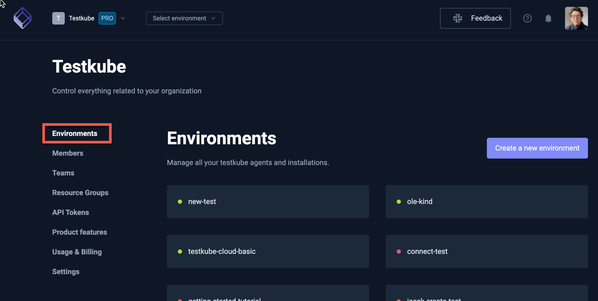
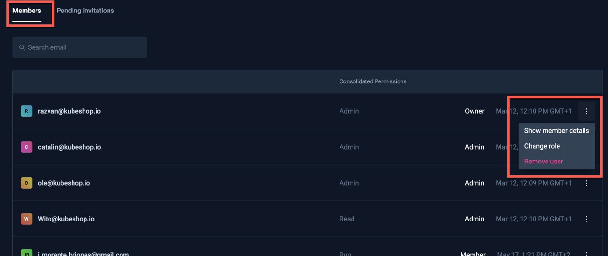

# Organization Management

To manage your organization settings click "Organization Management" from organizations drop-down menu:


(You can also create new organizations from this menu).

The following tabs are available for managing an Organisation.

## Environments

In the environments section, you can see the list of your existing environments.



GREEN status means that your agent is connected successfully. 

In the case of a RED status, you can try to debug the issues with the command below:

```sh
testkube agent debug
```

Run this on your cluster where the given agent is installed.

Read more about [Environment Management](../articles/environment-management.md).

## Settings

In settings, you can update the name of the organization, set artifacts limits, or enable or disable AI Hints and Webhooks URL Masking.


## Members

Invite and manage your organisation members here. 

### Inviting Members

Invite new members by specifying their email and role and selecting the Invite button in the bottom right.

There are 4 roles for organization members:

* `Owner` - Has access to all environments and organization settings, also can access billing details.
* `Admin` - Has access to all environments and organization settings.
* `Member` - Has limited access to environments, access is defined by the roles assigned to given member. Member by default doesn't have any access, you need to [explicitly set it in the given environment](environment-management.md).
* `Biller` - Has access to billing details only.


:::tip
For Testkube On-Prem deployments you can configure default organizations, environments and roles for users - see 
[Bootstrap Configuration](/articles/install/advanced-install#bootstrap-configuration).
:::

### Manage existing Members

Manage existing members/invites in the lists of members and pending invitations. Use the menu to the right for 
each member to delete them or change their role.



## API Tokens

API tokens allows running tests without linking the run to a specific account - see [API Token Management](api-token-management) 
for more details on how to create and use API Tokens.


## Usage & Billing

This section shows your current usage against the limits of your current plan.


For more details about the Testkube offerings, check our [pricing page](https://testkube.io/pricing).


If you are using the cloud version of Testkube you can upgrade your plan here. 
Once on the commercial plan, you will automatically be charged for additional 
users and environments in line with the current [Pricing Model](https://testkube.io/pricing).


