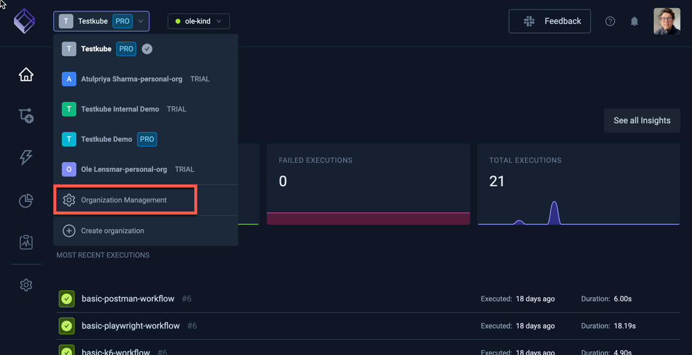
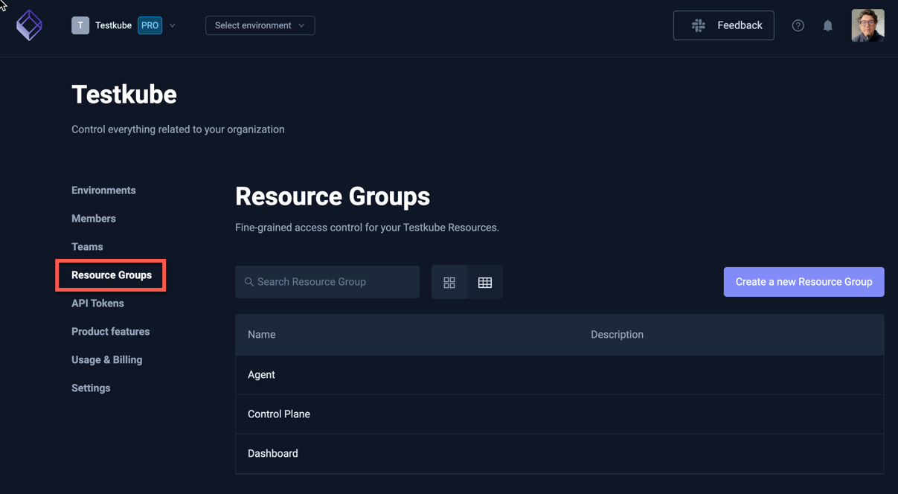
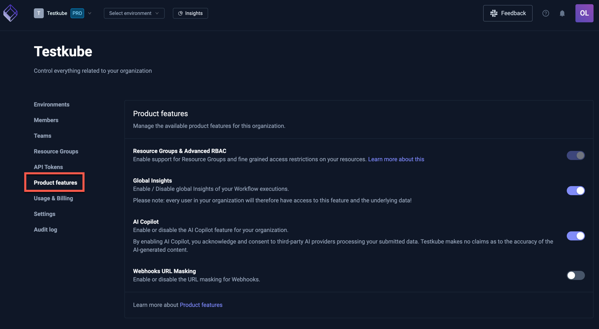
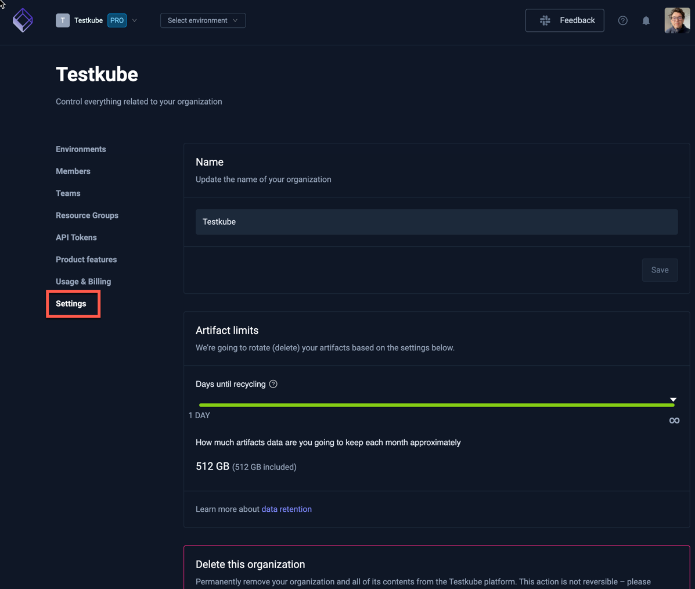

# Organization Management

To manage your organization settings click "Organization Management" from organizations drop-down menu:



(You can also create new organizations from this menu).

## Environments

In the environments section, you can see the list of your existing environments.


GREEN status means that your agent is connected successfully.

In the case of a RED status, you can try to debug the issues with the command below:

```sh
testkube agent debug
```

Run this on your cluster where the given agent is installed.

Read more about [Environment Management](../articles/environment-management.md).

## Members

The members section allows you to invite and manage your organizations' members and their roles - [Read More](member-management)


## Teams

Teams allow you to group Organization members to simplify access control management for Environments
and Resource Groups - [Read More](/articles/teams).


## Resource Groups

Resource Groups allow you to group Testkube Resources across all your environments and assign
member access - [Read More](/articles/resource-groups).



## API Tokens

API tokens allows running tests without linking the run to a specific account - see [API Token Management](api-token-management)
for more details on how to create and use API Tokens.


## Product Features

This tab allows you to configure Organization-level Product Features:

- **Resource Groups & Advanced RBAC** - Not toggleable, this just indicates if [Resource Groups](/articles/resource-groups) functionality is available (included with SSO).
- **Global Insights** - Toggle Global Insights of your Workflow executions - [Read More](/articles/test-insights).
- **AI Assistant** - Toggle the AI Assistant feature for your organization [Read More](/articles/ai-assistant-overview).
- **Webhooks URL Masking** - Toggle Webhooks URL masking - [Read More](/articles/webhooks#url-masking).
- **Agent Token Masking** - Toggle Agent Token masking - [Read More](/articles/agents-overview#agent-token-masking).



## Usage & Billing

This section shows your current usage against the limits of your current plan.


Usage shows

- Members - the number of Member Seats currently used from your license/plan.
- Environments - the number of Testkube Environments currently created against the number in your license/plan.
- Fixed Agents - the number of Runner Agents using a Fixed License - [Read More](/articles/agents-overview#licensing-for-runner-agents).
- Concurrent Floating Runner Agents - the number of Agents assigned a Floating license concurrently running Workflows over the last 30 days - [Read More](/articles/agents-overview#licensing-for-runner-agents).

:::tip
For more details about the Testkube offerings, check out the Testkube [Pricing Page](https://testkube.io/pricing).
:::

### Upgrading your Plan

If you are using the cloud instance of the Testkube Control-Plane you can upgrade your plan on the bottom of this page.
Once on the commercial plan, you will automatically be charged for additional users and environments in line with the current [Pricing Model](https://testkube.io/pricing).

:::tip
Don't hesitate to [Contact Us](https://testkube.io/contact) if you have any questions about pricing, your plan, limits, etc.
:::

## Settings

In settings, you can update the name of the organization, set artifacts limits, or enable or disable AI Hints and Webhooks URL Masking.



## Audit Log

The Audit Log provides insights into usage of your Testkube instance - [Read More](audit-logs)


