# Introduction to the Testkube Status Page

Status Pages provides a centralized platform for visualizing the health and performance of your software in real-time. You can use this feature to keep track of the status of your services, communicate issues to stakeholders (customers, internal teams, etc.), and ensure everyone’s on the same page.

For more information on how to use the Testkube Status Page, see the blog  
[Leveraging Kubernetes Test Results for Application Monitoring](https://testkube.io/learn/leveraging-kubernetes-test-results-for-application-monitoring).

## Status Pages for Monitoring Kubernetes Applications

Monitoring Kubernetes applications in a cloud-native environment is critical to ensuring their performance, reliability, and overall health. A status page can improve the performance and reliability of Kubernetes applications, optimize resource utilization, and reduce downtime costs. Here are a few key reasons why monitoring Kubernetes applications with status pages is important:

* Transparency: Keep all stakeholders informed about the status of your software.
* Efficiency: Quickly detect and respond to issues, minimizing downtime.  
* Customization: Tailor your status page to match your brand and information needs.  
* Real-time monitoring: Updates teams on the health and performance of services, allowing them to monitor their systems and testing in real-time.  
* Cross-team collaboration: Allows technical and non-technical teams to stay up to date on the current state of services, hence enhancing communication and collaboration.

## Accessing Status Pages in Testkube

To access Testkube Status Pages from the Testkube dashboard, follow the steps below:

1. Log in to your [Testkube Pro account](https://app.testkube.io/).  
2. Go to the Dashboard.  
3. Click on "Status Pages" in the left navigation panel.

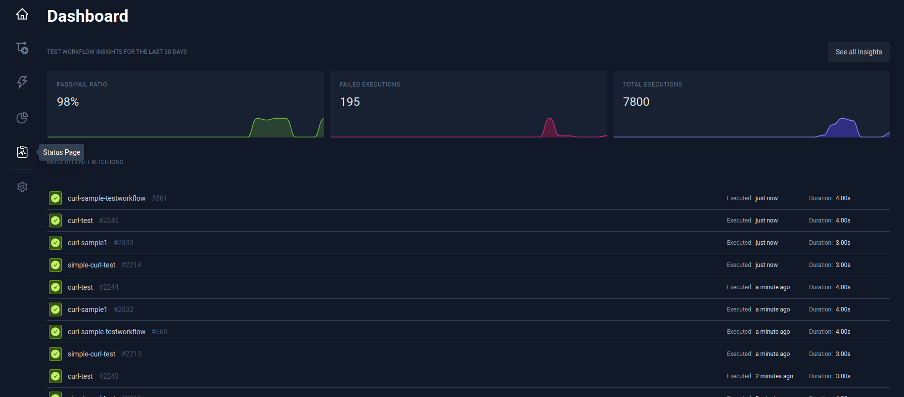

This will take you to the Status Page section, where you can create, view, and manage your status pages.

## Creating a Status Page Using Testkube

Creating a status page with Testkube simplifies the process of monitoring and communicating application health. Testkube's status page is dedicated to tracking the real-time performance, availability, and incident history of Kubernetes applications, ensuring that both technical and non-technical stakeholders are kept up to date on any issues that arise.

On the Status Page in the Testkube dashboard, you will see the following three tabs: 

* General  
* Services  
* Incidents

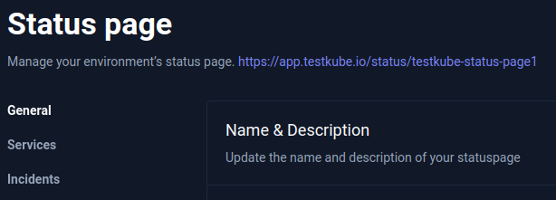

To configure the Status Page, you will have to add relevant details to all these sections as shown below.

### General {#general}

1. In General, provide your status page with a unique name and description, and then save it. Testkube will create an endpoint that allows your Status Page to be accessed securely.  

   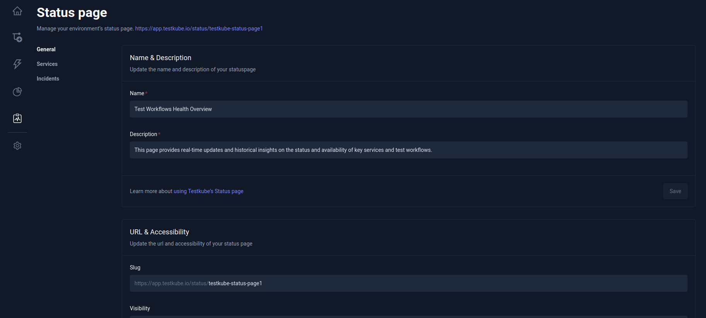 

2. Next, update the URL and accessibility sections of the status page and save it.  

   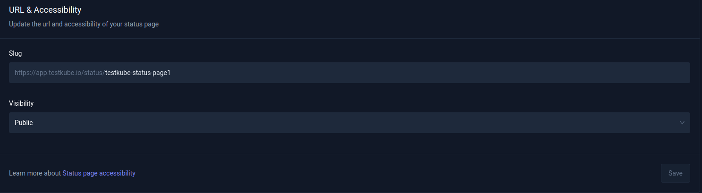  

   Slug is the part of the URL that comes after the main domain and makes it easier to access the page. Additionally, based on who you wish to share incident updates with, you can manage who can view the status page by selecting the Visibility drop-down menu.  

3. In the “Time Scale” section, select “Hours” or “Days” from the drop-down menu.  

   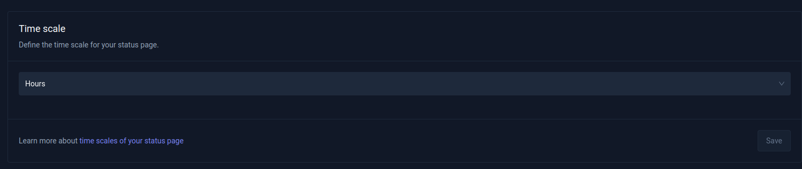  

   This section allows you to specify the time scale in hours or days when viewing incident history or uptime details.  

4. After selecting your preferred time scale, click “Save” to apply the changes to the status page.

### Services {#services}

1. Select Services. Click the "Add" button and add the name to your service.   

   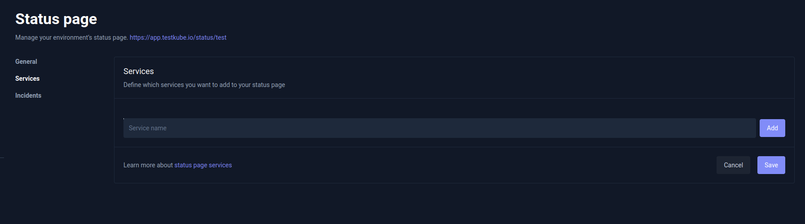

2. Select the relevant Test Workflows from the dropdown menu.

   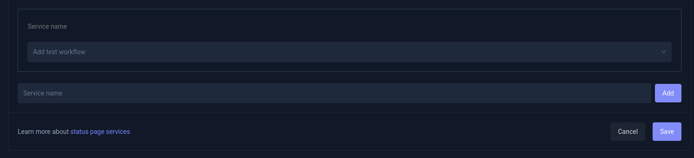

3. Save your changes and access the Status Page URL to see if it's reporting data about your services.   

   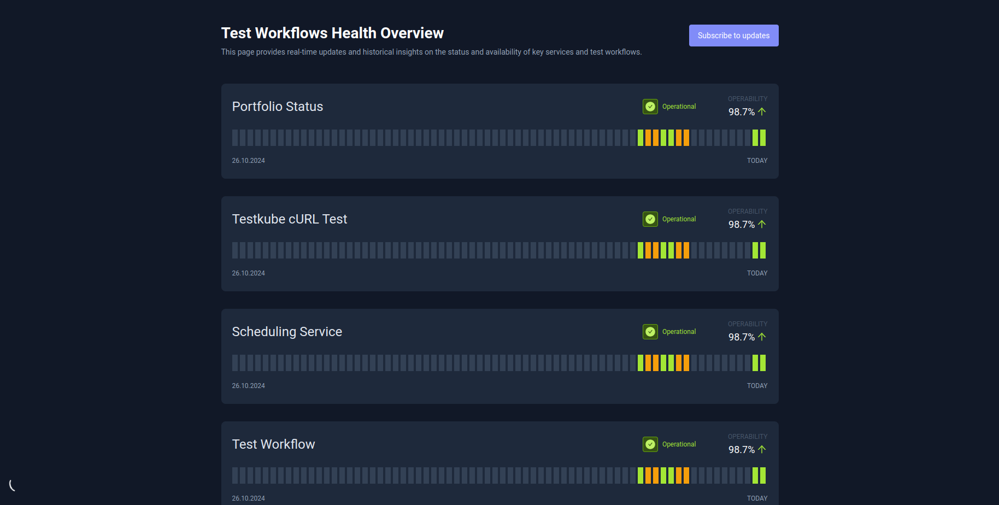

   If there is an issue with one of the services, you can easily create and manage incidents to keep users informed.

### Incidents {#incidents}

1. Select Incidents. Click the “Add a New Incident” button. A "Create a new incident" dialog box will appear.

   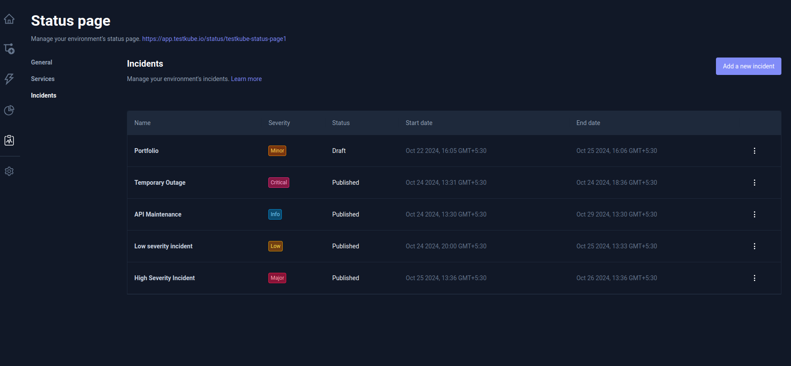  
     
2. Fill out the required fields:  
   * Incident Name   
   * Severity  
   * Visibility  
   * Incident description  
   * Start and End Dates

	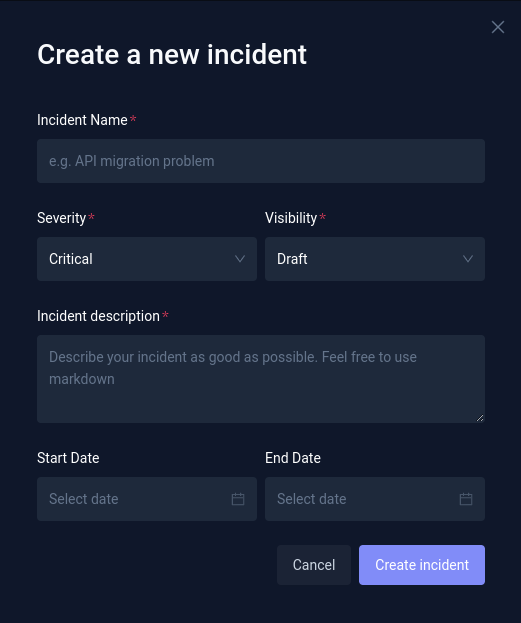

3. To create an incident, click the “Create Incident” button.

The incident(s) created will be displayed on the Status page.

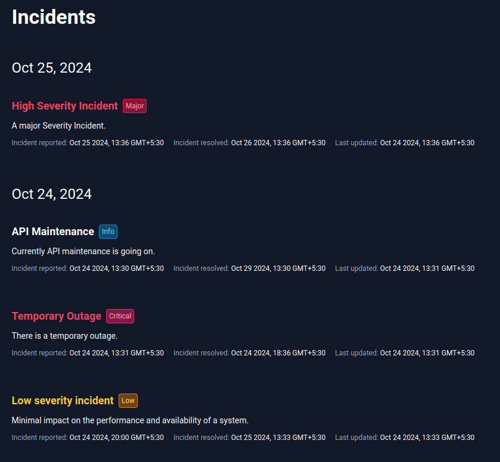
  
You can include details about outages, maintenance, and other information relevant to the status of your application. You can easily manage the incidents by clicking the three vertical dots next to them.

Here is how the Status Page looks for us:

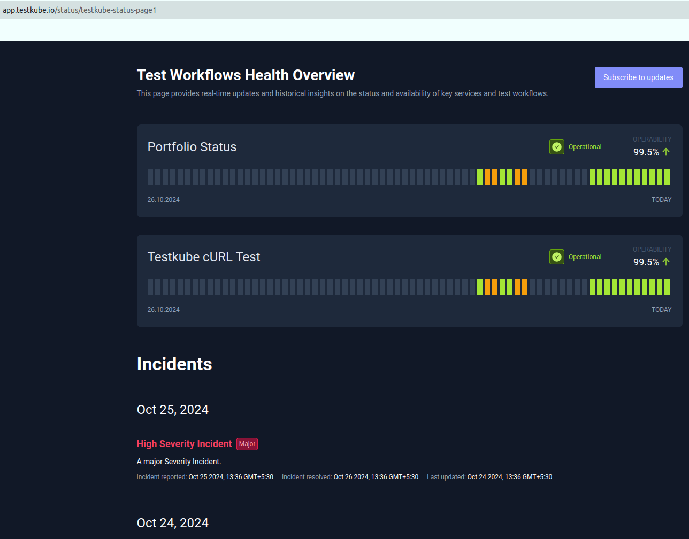

## Managing Status Pages

After you've created the Status page, you can begin monitoring your services and communicating with multiple stakeholders to stay informed about them, ensuring smooth operations and a prompt response to any issues that may arise.

### Sharing Status Pages

The Status Page URL will appear at the top of this page. If your status page is public, simply share its URL with stakeholders. For private pages, make sure the intended users have access to your organization's services. To choose between Public and Private visibility, refer to the General tab.

### Understanding Service Statuses

The Status Page displayed is unique to each Testkube environment. You can only have one Status Page per environment, so make sure the tests you add accurately reflect the status of the services. On the very top of the screen, you will see the name of your Status Page and its description.   
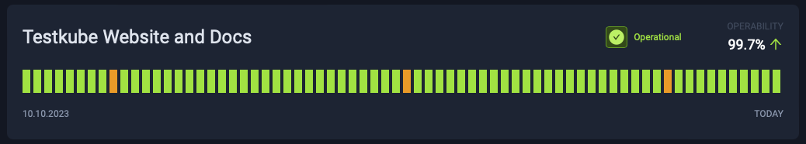

Below that, you will see a list of the services with multiple ways to represent their state. On the top left is the name of the service. The top right is the current status \- this is calculated based on the last bar of the chart below. The possible values are:

* Operational (Green): All tests passed in the last instance of the configured time scale.  
* Partial Outage (Orange): At least one test failed and one test succeeded in the last instance of the configured time scale.  
* Major Outage (Red): All tests failed in the last instance of the configured time scale.  
* Unknown (Grey): No data at all or some tests were not executed in the last instance of the configured time scale.

The colors are similar to the service status colors. When you hover over the colors, you can clearly see which tests failed, passed, or did not run:

* Red: All tests failed in the time range of the bar.  
* Orange: At least one test failed, and one test passed in the time range of the bar.  
* Green: All tests succeeded in the time range of the bar.  
* No executions.

Make sure the test names are easy to understand for your users, as they will be made public once you publish this page. Schedule your tests to ensure that the status of your service is always reflected.

### Managing Environment Incidents

Testkube Status Pages simplify incident management processes by providing a single platform for all recorded incidents related to environment status, allowing users to effectively manage, log, and track incidents. This allows teams to view and respond to incidents more efficiently, maintain transparency with stakeholders, and constantly improve incident response procedures to ensure the reliability of their software or services.

Incidents are a process for communicating between service providers and their customers. You can create and manage incidents from the Status Pages management page.

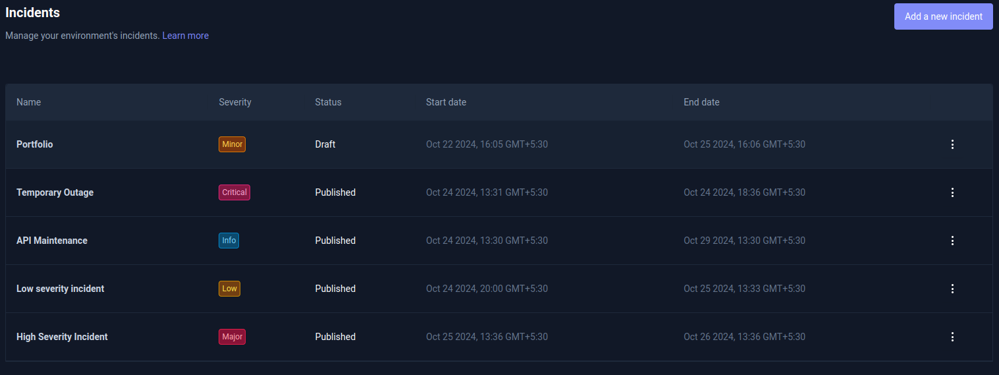

The incident tab displays several incidents that have been logged for tracking purposes. It displays the following information in each column:

* **Name**: This column contains the titles or brief descriptions of each incident, allowing for quick reference to understand the nature of each incident.

* **Severity**: The incident's title will be colored based on the configured severity.

* **Critical**: The most urgent level, where the problem could seriously impair system performance or availability. It is indicated by the color red.  
* **Major**: Identifies high-impact issues that may affect a larger portion of the system. It is indicated by the color red.  
* **Minor**: Identifies low-impact issues that may cause minimal disruption. It's orange in color.  
* **Low**: Used to describe non-critical incidents that do not require immediate attention. It's yellow in color.  
* **Info**: Displays informational updates without making a significant impact. It's blue in color.

The severity of the situation is up to the team's discretion; simply ensure that everyone is informed and has agreed to it. 

* **Status**: Incidents have two statuses based on their visibility: 

  * Draft: The incident is still being prepared and has not been published yet.  
  * Published: The incident has been published, making it visible on the status page and easily available for the users to view and understand.

* **Start and End Date**: These columns specify the date and time when the incident began and when the incident ended or is expected to end.

Click the [Incident](#incidents) to learn how to create a new incident. 

## Collaboration and Access Control[​](https://docs.testkube.io/testkube-pro/articles/status-pages#collaboration-and-access-control)

Status Pages can be either private or public. Public status pages are published on the internet. Any individual within the same organization with read access to the environment can share private pages.

## Best Practices for Using Testkube Status Pages

Best practices are essential for effectively using Testkube Status Pages to communicate the status of your software projects. These practices help ensure that your status pages are informative, reliable, and serve their intended purpose. Here are some best practices for Testkube Status Pages:

### **Designing Effective Status Pages**

Clear and Concise Information: Keep the information on your status page clear, concise, and relevant. Avoid technical jargon that might confuse non-technical stakeholders.

Use Visuals: Utilize the visual element test status indicators to make it easier for users to understand the current status at a glance.

Test Grouping: Group related tests logically, making it easier for users to navigate and understand the status of different parts of your software services.

Real-Time Updates: Ensure that incident updates are added in real-time to reflect the most current information.

Incident History: Maintain a visible incident history or log so users can review past incidents and resolutions.

### **Incident Response Guidelines**

Defined Roles and Responsibilities: Clearly define the roles and responsibilities of team members involved in incident response. This includes incident commanders, communicators, and technical responders.

Incident Severity Levels: Establish a clear and consistent system for categorizing incident severity levels. This helps prioritize response efforts. Testkube provides six levels: critical, major, minor, low, and information.

Communication Plan: Develop a communication plan that outlines how and when to communicate with stakeholders during incidents. Ensure that communication is timely, transparent, and accurate.

Escalation Procedures: Define procedures for escalating incidents when they cannot be resolved at lower levels. Identify when and how to involve senior management or additional resources.

Post-Incident Reviews: Conduct post-incident reviews (post-mortems) after each incident to analyze what went well and what could be improved. Use these reviews to update incident response procedures.

### **Regular Maintenance**

Scheduled Updates: Regularly update the status page, even during periods of normal operation. This demonstrates that the page is actively maintained and reliable.

Test Alerting: Periodically test your alerting and incident response mechanisms to ensure they are functioning correctly.

Documentation Updates: Keep documentation related to your status pages up-to-date, including service descriptions, contact information, and incident response procedures.

Training: Ensure that team members participating in incident response receive sufficient training and stay current with best practices.

### **User Engagement**

Stakeholder Awareness: Promote awareness of the status page among your stakeholders, including both internal teams and external users.

Feedback Loop: Encourage your users to provide feedback on the status page's usefulness and clarity. Use this feedback to make improvements.

### **Custom Slug Configuration**

Custom Slugs: If applicable, configure custom slugs for your status pages to match your brand and make them more accessible to users.

These best practices will help you maximize the effectiveness of Testkube Status Pages, ensuring that it serves as a valuable communication tool for both technical and non-technical stakeholders. By following these guidelines, you can maintain transparency, respond efficiently to incidents, and provide a reliable source of information about the status of your software projects.

If you have any questions or need assistance, our team is ready to assist you in our [Slack Channel](https://testkubeworkspace.slack.com/join/shared_invite/zt-2arhz5vmu-U2r3WZ69iPya5Fw0hMhRDg#/shared-invite/email).